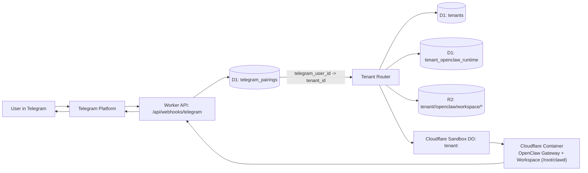

# OpenClaw AaaS

Managed service for running template-based OpenClaw agents with:
- tenant onboarding
- queued run orchestration
- BYOK model execution via Cloudflare AI Gateway
- subscription-gated access using Stripe webhooks

This repository is a monorepo with a web control plane and a Cloudflare Worker API.

## Product Overview

`OpenClaw AaaS` is designed for teams that want to ship agent workflows without building platform infrastructure first.

Core idea:
- Customer creates a tenant.
- Customer selects an agent template.
- Customer launches a run (optionally with BYOK model key).
- Backend validates subscription, queues execution, updates run lifecycle, and coordinates agent execution.

## Repository Layout

- `apps/web`: Next.js UI (landing, signup, dashboard, API proxy routes)
- `apps/worker-api`: Cloudflare Worker backend (tenants, templates, runs, subscriptions, queue consumer)
- `docs/security`: BYOK and baseline security policies
- `docs/runbooks`: operational runbooks
- `docs/plans`: implementation plans and architecture notes

## Architecture

Frontend (`apps/web`):
- Serves UI pages.
- Proxies backend calls through `pages/api/control/*`.
- Uses `WORKER_API_BASE_URL` server-side to reach Worker API.

Backend (`apps/worker-api`):
- `fetch` routes:
- `/healthz`
- `/api/tenants`
- `/api/templates`
- `/api/runs`
- `/api/auth/*`
- `/api/telegram/*`
- `/api/webhooks/stripe`
- `/api/subscriptions`
- `/api/runtime/skills`
- `queue` consumer processes run messages and updates D1 run status.
- Durable Object `AgentSession` coordinates per-agent execution sessions.
- Storage/bindings: D1 (`DB`), R2 (`ARTIFACTS`), Queue (`RUN_QUEUE`), Durable Object (`AGENT_SESSION`).

### Cloudflare Mapping

This is how OpenClaw Autopilot components map to Cloudflare infrastructure:

| Product Component | Cloudflare Primitive | Purpose |
| --- | --- | --- |
| API layer (`apps/worker-api`) | Workers | Handles auth, tenant config, Telegram pairing, runs, and webhook endpoints |
| Persistent app data | D1 (`DB`) | Stores tenants, accounts/sessions, pairing state, runs, and subscription state |
| Async run execution | Queues (`RUN_QUEUE`) | Decouples request/response from run processing and retries |
| Agent runtime coordination | Durable Objects (`AGENT_SESSION`) | Keeps per-agent execution/session state consistent |
| Artifacts/output storage | R2 (`ARTIFACTS`) | Stores run artifacts and generated output blobs |
| Model provider abstraction | AI Gateway | Routes BYOK model calls with provider-agnostic observability |
| Billing events ingress | Worker webhook (`/api/webhooks/stripe`) | Receives Stripe subscription lifecycle updates |
| Telegram ingress | Worker webhook (`/api/telegram/webhook`) | Receives chat updates and forwards to tenant-scoped execution |

High-level flow:

1. User uses `apps/web` UI at `autoclaw.sh`.
2. Next.js API routes proxy requests to Worker API (`WORKER_API_BASE_URL`).
3. Worker validates auth/session and writes state to D1.
4. Long-running work is enqueued to `RUN_QUEUE`.
5. Queue consumer invokes `AgentSession` and model calls (AI Gateway/BYOK), then persists run status/results.

### Shared Telegram + Tenant Runtime Architecture

The product uses one shared Telegram bot. Tenant isolation is handled by pairing each Telegram user to a tenant, then routing requests into that tenant's OpenClaw runtime workspace.



Runtime lifecycle per tenant:

1. Telegram message hits `/api/webhooks/telegram`.
2. Pairing lookup resolves `telegram_user_id` to `tenant_id`.
3. Runtime state is checked in `tenant_openclaw_runtime`.
4. If needed, Worker bootstraps workspace files from R2 and starts tenant sandbox/container.
5. Request is routed to tenant OpenClaw gateway process.
6. Reply is sent back through Telegram.

### Runtime Skills Inventory + Policy

The backend now exposes tenant-scoped runtime skills from the actual OpenClaw sandbox:

- `GET /api/runtime/skills?tenantId=<id>`
- optional `includeHidden=true`
- `GET /api/runtime/skills/packs` for curated pack definitions
- `POST /api/runtime/skills/packs` to apply a pack for a tenant

This endpoint:
- ensures tenant runtime bootstrap/startup,
- runs `openclaw skills list --json` inside tenant runtime,
- merges per-tenant policy from D1 (`tenant_runtime_skill_policy`),
- returns `effectiveReady` for each skill.

Policy updates are supported with:

- `PATCH /api/runtime/skills`

Body:

```json
{
  "tenantId": "t_123",
  "policies": [
    { "name": "weather", "allowed": true, "enabled": true, "hidden": false }
  ]
}
```

Policy semantics:
- `allowed=false`: explicitly disallow skill for tenant policy.
- `enabled=false`: keep skill installed/visible in policy but disabled for tenant usage.
- `hidden=true`: hide skill from default skills list responses unless `includeHidden=true`.

Pack semantics:
- `basic`: starter setup focused on safe day-to-day capability.
- `creator`: research/content oriented setup.
- `ops`: technical operations oriented setup.
- New tenants get `basic` automatically on first runtime bootstrap (only when no policy exists).

## Request Flow (Happy Path)

1. UI posts `POST /api/control/runs`.
2. Next.js API route proxies to Worker `POST /api/runs`.
3. Worker checks tenant subscription status.
4. Worker writes queued run in D1 and enqueues run payload.
5. Queue consumer marks run running, optionally calls AI Gateway using BYOK key, invokes `AgentSession`, then marks run succeeded/failed.

## Prerequisites

- Node.js 22.x (tested with v22.22.0)
- npm 9+
- Cloudflare account for Worker development/deploy
- Wrangler CLI (installed via workspace dependencies)

## Getting Started (Developers)

### 1. Install dependencies

```bash
npm install
```

### 2. Run web UI locally

```bash
npm run dev:web
```

Open `http://localhost:3000`.

Optional web env vars:
- `WORKER_API_BASE_URL`: Worker API base URL used by server-side proxy routes.
- `NEXT_PUBLIC_STRIPE_STARTER_URL`: Starter checkout URL used by signup flow.

### 3. Run Worker API locally

```bash
npm run dev:worker
```

Wrangler config lives at `apps/worker-api/wrangler.jsonc`.

### 4. Run backend checks

```bash
npm run test:worker
npm run typecheck:worker
```

### 5. Build web app

```bash
npm run build:web
```

## If Backend Is Already Deployed

You can develop only the UI and point it to deployed backend:

1. Set `WORKER_API_BASE_URL` to deployed Worker URL.
2. Run `npm run dev:web`.
3. Use UI pages (`/signup`, `/dashboard`, `/pricing`) against live backend.

## Deployment Notes

Frontend:
- Deploy `apps/web` as a Next.js server app (for API routes), e.g. Vercel.
- Configure `WORKER_API_BASE_URL` in deployment env.

Backend:
- Deploy Worker from `apps/worker-api` with Wrangler:

```bash
npm run deploy -w apps/worker-api
```

- Ensure Cloudflare bindings and secrets are configured:
- D1 database
- R2 bucket
- Queue producer/consumer
- Durable Object migration
- `STRIPE_WEBHOOK_SECRET`
- `CF_ACCOUNT_ID`
- `AI_GATEWAY_ID`

## Security and BYOK

Policy docs:
- `docs/security/byok-policy.md`
- `docs/security/cloudflare-baseline.md`

Current policy intent:
- BYOK keys are customer-supplied and not persisted in D1.
- Keys are used for outbound model calls only.
- Redaction and operational hardening are required before GA.
