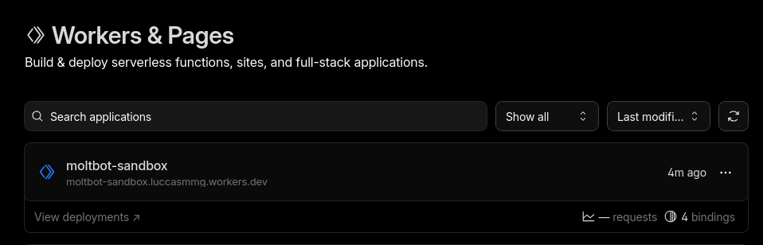
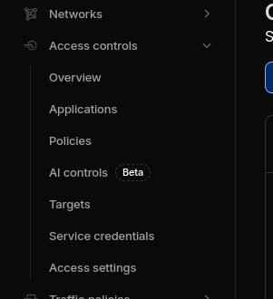
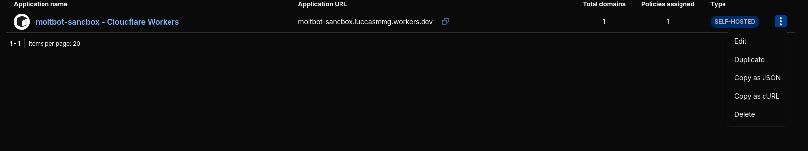

# Deploying OpenClaw on Cloudflare

This guide covers the deployment model used by [`cloudflare/moltworker`](https://github.com/cloudflare/moltworker). OpenClaw runs inside a Cloudflare Sandbox container behind a Worker. It is not a D1-and-Queues deployment.

Cloudflare's own docs line up with that model: container deployments are configured in `wrangler.jsonc` via `containers`, a matching Durable Object binding and migration, optional `r2_buckets`, and `triggers.crons`.

> **Experimental:** The `moltworker` repo is a proof of concept, not an officially supported OpenClaw deployment target. Expect rough edges.

> **Looking for multi-tenant?** If you need to run OpenClaw as a service for multiple users, see the [openclaw-aaas example](https://github.com/datopian/autoclaw.sh/tree/main/examples/openclaw-aaas).

## What you are deploying

- A Cloudflare Worker that fronts OpenClaw
- A Cloudflare Sandbox container built from `Dockerfile`
- A `Sandbox` Durable Object that controls the container lifecycle
- Optional R2-based backup/restore persistence
- Cloudflare Access in front of the admin UI
- A cron trigger that can wake the container before scheduled jobs run

In the `moltworker` repo, this shows up directly in `wrangler.jsonc`:

- `containers` points at `./Dockerfile`
- `durable_objects` binds the `Sandbox` class
- `migrations` creates the SQLite-backed Durable Object class
- `r2_buckets` binds `BACKUP_BUCKET`
- `triggers.crons` runs every minute

## Prerequisites

- Cloudflare account on the Workers Paid plan
- Cloudflare Containers / Sandbox enabled for the account
- `wrangler` installed: `npm install -g wrangler`
- Logged in with `wrangler login`
- An Anthropic API key, or Cloudflare AI Gateway plus an upstream provider key
- Comfort with Wrangler, secrets, and Cloudflare Access

**Cost:** This is not a cheap edge-only Worker deployment. The `moltworker` README estimates about `$34.50/month` for a `standard-1` container running 24/7, or about `$10-11/month` if you let it sleep aggressively when idle.

## 1. Clone the reference repo

```bash
git clone https://github.com/cloudflare/moltworker.git
cd moltworker
npm install
```

The repo's deploy script is simply:

```bash
npm run deploy
```

which runs `npm run build && wrangler deploy`.

## 2. Set the required secrets

You need one AI provider path and one gateway token.

### Direct Anthropic access

```bash
npx wrangler secret put ANTHROPIC_API_KEY
```

### Or Cloudflare AI Gateway

```bash
npx wrangler secret put CLOUDFLARE_AI_GATEWAY_API_KEY
npx wrangler secret put CF_AI_GATEWAY_ACCOUNT_ID
npx wrangler secret put CF_AI_GATEWAY_GATEWAY_ID
```

If AI Gateway is configured, `moltworker` uses it in preference to direct `ANTHROPIC_API_KEY` or `OPENAI_API_KEY`.

### Gateway token for remote access

```bash
export MOLTBOT_GATEWAY_TOKEN=$(openssl rand -hex 32)
echo "Your gateway token: $MOLTBOT_GATEWAY_TOKEN"
echo "$MOLTBOT_GATEWAY_TOKEN" | npx wrangler secret put MOLTBOT_GATEWAY_TOKEN
```

Save that token. You will need it to access the Control UI.

## 3. Deploy the Worker and container

```bash
npm run deploy
```

After deploy, your Control UI will be available at:

```text
https://your-worker.workers.dev/?token=YOUR_GATEWAY_TOKEN
```

Replace `your-worker` with your actual worker name and `YOUR_GATEWAY_TOKEN` with the value you generated.

**Note:** The first request may take 1-2 minutes while the container starts.

## 4. Protect the admin UI with Cloudflare Access

The `moltworker` admin UI lives at `/_admin/`. The repo expects you to protect it with Cloudflare Access and then give the worker enough information to validate Access JWTs.

### Enable Access on the Worker

The simplest path is the built-in `workers.dev` Access integration:

1. Open **Workers & Pages** in the Cloudflare dashboard.


2. Select your Worker.
3. Go to **Settings** > **Domains & Routes**.
4. In the `workers.dev` row, open the `...` menu and enable **Cloudflare Access**.


5. Go to **Zero Trust** > **Access controls** > **Applications**
6. Copy the application's Audience tag (`AUD`).





### Set the Access secrets

```bash
npx wrangler secret put CF_ACCESS_TEAM_DOMAIN
npx wrangler secret put CF_ACCESS_AUD
```

- `CF_ACCESS_TEAM_DOMAIN` looks like `{your username}.cloudflareaccess.com`
- `CF_ACCESS_AUD` is the audience tag from the Access application

### Redeploy after adding Access secrets

```bash
npm run deploy
```

After that, visiting `/_admin/` should prompt you to authenticate through Cloudflare Access.

## 5. Pair your first device

`moltworker` uses device pairing by default.

1. Open the Control UI with `?token=YOUR_GATEWAY_TOKEN`.
2. In another tab, open `https://your-worker.workers.dev/_admin/`.
3. Sign in through Cloudflare Access.
4. Approve the pending device pairing request.

The gateway token alone is not enough for a new device. The repo requires explicit approval through the admin UI.

## 6. Add persistence with R2

By default, data inside the container is ephemeral. If the container restarts, paired devices, configs, and conversation history are lost unless you configure R2.

### Create an R2 API token

According to the `moltworker` README, the default bucket is `moltbot-data`. Create an R2 API token with **Object Read & Write** permissions for that bucket.

### Set the R2 secrets

```bash
npx wrangler secret put R2_ACCESS_KEY_ID
npx wrangler secret put R2_SECRET_ACCESS_KEY
npx wrangler secret put CF_ACCOUNT_ID
```

If you are using a custom bucket name, also set:

```bash
npx wrangler secret put BACKUP_BUCKET_NAME
```

### Redeploy

```bash
npm run deploy
```

### How persistence works

The repo uses a backup/restore model rather than a live mounted database:

- On startup, the container restores backup data from R2 if it exists.
- During normal operation, a cron job syncs config data back to R2 every 5 minutes.
- The admin UI exposes backup status and a manual **Backup Now** action.

## 7. Tune container sleep behavior

By default, `SANDBOX_SLEEP_AFTER=never`, which avoids repeated cold starts but costs more.

To let the container sleep when idle:

```bash
npx wrangler secret put SANDBOX_SLEEP_AFTER
```

Example values: `10m`, `30m`, `1h`.

Trade-off:

- Lower cost when idle
- 1-2 minute cold starts when the container wakes up again

## 8. Optional extras

### Chat channels

Set the relevant secrets and redeploy:

```bash
npx wrangler secret put TELEGRAM_BOT_TOKEN
npx wrangler secret put DISCORD_BOT_TOKEN
npx wrangler secret put SLACK_BOT_TOKEN
npx wrangler secret put SLACK_APP_TOKEN
npm run deploy
```

### Browser automation

For the built-in CDP shim:

```bash
npx wrangler secret put CDP_SECRET
npx wrangler secret put WORKER_URL
npm run deploy
```

## Verifying the deployment

- Open `https://your-worker.workers.dev/?token=YOUR_GATEWAY_TOKEN`
- Confirm the Control UI loads after the container starts
- Open `/_admin/` and confirm Cloudflare Access is enforced
- Confirm your device appears under paired devices
- If R2 is configured, confirm the admin UI shows backup status
- Use `npx wrangler tail` to inspect logs if startup looks wrong

## Common issues

**`npm run dev` fails with `Unauthorized`**
Cloudflare Containers are not enabled for your account yet. Enable them in the Containers dashboard.

**Admin routes return access denied**
Check `CF_ACCESS_TEAM_DOMAIN`, `CF_ACCESS_AUD`, and your Access policy.

**Slow first request**
This is expected. Cold starts can take 1-2 minutes.

**R2 persistence is not working**
Check that `R2_ACCESS_KEY_ID`, `R2_SECRET_ACCESS_KEY`, and `CF_ACCOUNT_ID` are all set. The repo notes that R2 mounting only works in production, not `wrangler dev`.

**Gateway fails to start**
Run `npx wrangler secret list` and `npx wrangler tail` and verify your AI-provider configuration and gateway token are present.

**WebSockets work poorly in local development**
The repo documents limitations in `wrangler dev` with sandbox WebSocket proxying. Test against a real deployment if you need full browser or chat behavior.

## Next steps

- [Choosing infrastructure](./choosing-infrastructure.md) — compare Cloudflare to VPS, PaaS, and local hosting
- [Secure / private deployments](./secure-private-deployment.md) — lock down your instance further
