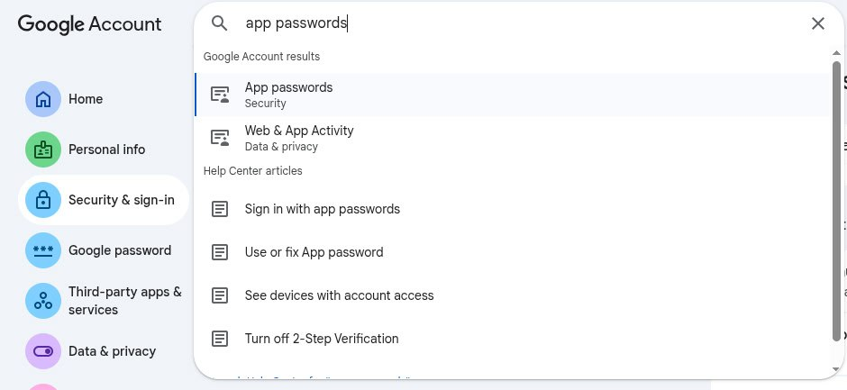

# Email Integration for Agents

If you are just getting started and you want OpenClaw to read your Gmail inbox for things like summaries, daily digests, or simple alerts, IMAP is the cleanest place to start.

This setup is simpler than building a full Gmail API integration:

- IMAP gives OpenClaw read access to your mailbox
- Gmail App Passwords avoid using your normal account password
- SMTP can be added later if you also want to use this for sending or draft workflows

For most beginner setups, this is the path that works fastest.

## What you are setting up

You are giving OpenClaw access to Gmail through standard mail protocols:

- IMAP for reading email from your inbox
- Optional SMTP for sending mail later

With this in place, OpenClaw can handle workflows like:

- Summarize unread mail
- Produce a morning or evening inbox digest
- Alert you when messages from a person or keyword arrive
- Extract structured information such as receipt vendors or amounts

If you eventually need deep Gmail actions, labels, drafts, or broader Google Workspace access, use the more complete OAuth-based setup in [`google-workspace-integration`](../google-workspace-integration/README.md). For simple inbox-reading workflows, IMAP is the better starting point.

## 1. Turn on 2-Step Verification

Gmail App Passwords require 2-Step Verification.

Open your Google Account security settings:

- <https://myaccount.google.com/security>

Then:

1. Open `2-Step Verification`
2. Turn it on for the Google account you want OpenClaw to read

If you skip this step, Google usually will not show the `App passwords` option later.

## 2. Create a Gmail App Password

Once 2-Step Verification is enabled, create an App Password for OpenClaw.

From the same Google Account security area:



1. Open `App passwords`
4. Name it `OpenClaw`
5. Save the generated password

Google will give you a 16-character password. This is the password OpenClaw should use for IMAP and SMTP.

Do not use your normal Gmail password here.

## 4. Install the imap-smtp-email skill

Inside your OpenClaw machine run the clawhub command to install the `imap-smtp-email` skill:

```bash
openclaw@ubuntu-4gb-hel1-2:~$ clawhub install imap-smtp-email
✔ OK. Installed imap-smtp-email -> /home/openclaw/.openclaw/workspace/skills/imap-smtp-email
```

As you can see it installed the skill to `/home/openclaw/.openclaw/workspace/skills/imap-smtp-email`. This skill provides a mail connector that can read and send email using IMAP and SMTP.

Go into that directroy and run `bash setup.sh` to configure the connector, it should guide you through entering the IMAP and SMTP settings described in the next section.

## 4. Use these IMAP settings

When OpenClaw asks for email connection settings, use the following values:

### IMAP

- Host: `imap.gmail.com`
- Port: `993`
- Encryption: `SSL/TLS`
- Username: your full Gmail address, for example `name@gmail.com`
- Password: the 16-character Gmail App Password

### Optional SMTP

If your OpenClaw setup also wants to send email or save drafts through SMTP, use:

- Host: `smtp.gmail.com`
- Port: `465` for SSL or `587` for TLS
- Username: the same full Gmail address
- Password: the same Gmail App Password

## 5. Test with small prompts first

Do not start with a large workflow. First confirm that OpenClaw can read mail reliably.

Good test prompts:

```text
List the last 10 email subjects from my inbox.
```

```text
Summarize the newest email in 3 bullet points.
```

```text
If you see a receipt, tell me the vendor and amount.
```

If these work, the integration is usually in good shape.

## 6. Start with one safe automation

The best first automation is small and easy to verify.

Example daily digest:

- Run once each morning, for example at `9:00 AM`
- Look at unread emails
- Group them into `important`, `newsletters`, and `receipts`
- Produce a short 2-3 line summary for each item

Once that is stable, you can add more:

- Alerts for specific senders or keywords
- Draft replies for approval
- Moving or tagging messages
- Receipt extraction or expense tracking

## Reliability notes

Email integrations fail most often because they are too aggressive too early.

For a stable setup:

- Keep polling intervals reasonable
- Avoid opening too many IMAP connections in parallel
- Prefer IMAP IDLE if your mail connector supports it
- Recheck Google account security alerts if access suddenly stops working

## Common failures

**`Invalid credentials`**

You probably used your normal Gmail password instead of the App Password.

**`Too many connections`**

Your setup or another mail client is opening too many IMAP sessions at once. Reduce concurrency and polling frequency.

**It worked once, then stopped**

Google may have flagged the login as unusual. Check the account's security alerts, confirm the login, and avoid overly aggressive polling.

## Minimal checklist

Before you call this done, make sure all of these are true:

1. `2-Step Verification` is enabled on the Google account
2. A Gmail `App Password` was created for OpenClaw
4. OpenClaw is using `imap.gmail.com` on port `993` with `SSL/TLS`
5. The username is the full Gmail address
6. The password in OpenClaw is the App Password, not the normal Google password
7. A basic inbox-read prompt succeeds

At that point, OpenClaw should be able to read Gmail reliably enough for summaries, digests, and simple inbox monitoring.
