# Google Workspace Integration for Clawbot

This playbook shows how to give Clawbot access to Google Workspace using [`gogcli`](https://github.com/steipete/gogcli), a terminal-first Google client that works well from an agent runtime. The core pattern is simple:

1. Create a Google Cloud project
2. Enable the Google APIs Clawbot needs
3. Create an OAuth desktop client and download its JSON file
4. Put that JSON file on the Clawbot host
5. Use `gog` to authorize the target Google account
6. Let Clawbot call `gog` commands as needed

This is the best default setup when Clawbot is acting on behalf of a specific human user.

## What this gives you

Once configured, Clawbot can use Google Workspace from the shell, including:

- Gmail search, read, send, labels, drafts, and filters
- Calendar listing, search, create, update, and RSVP
- Drive upload, download, search, and sharing
- Docs, Sheets, Slides, Forms, Contacts, Tasks, and more

For most Clawbot deployments, start with OAuth user auth first. Only move to a service account with domain-wide delegation if you need org-wide admin access or Workspace-only APIs that require impersonation.

## 1. Create the Google Cloud project

Open the Google Cloud Console credentials area and create a project:

- Credentials: <https://console.cloud.google.com/apis/credentials>
- Project creation: <https://console.cloud.google.com/projectcreate>

Start by opening the project picker and creating a new project.

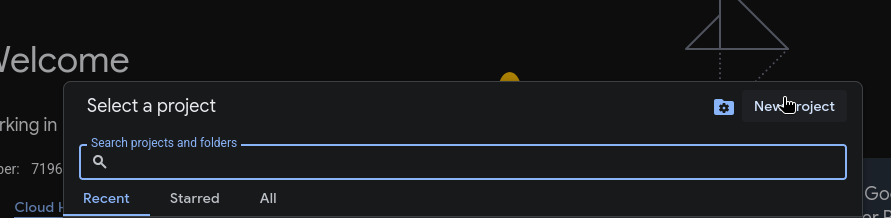

Then fill in the project form and create the project.

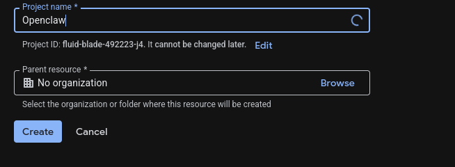

Use a dedicated project for Clawbot rather than reusing a random personal project. That makes it easier to audit scopes, rotate credentials, and separate dev from prod.

## 2. Enable the APIs you need

Enable only the APIs Clawbot actually needs. Common ones are:

- Gmail API
- Google Calendar API
- Google Drive API
- Google Docs API
- Google Sheets API
- People API
- Google Tasks API

If you expect Clawbot to work across more of Workspace, you can also enable:

- Google Slides API
- Google Forms API
- Google Chat API
- Admin SDK API
- Cloud Identity API

You can enable them from the API Library or directly from the URLs documented in the `gogcli` README.

One easy way to get there is to search for `api and services` from the Google Cloud console.

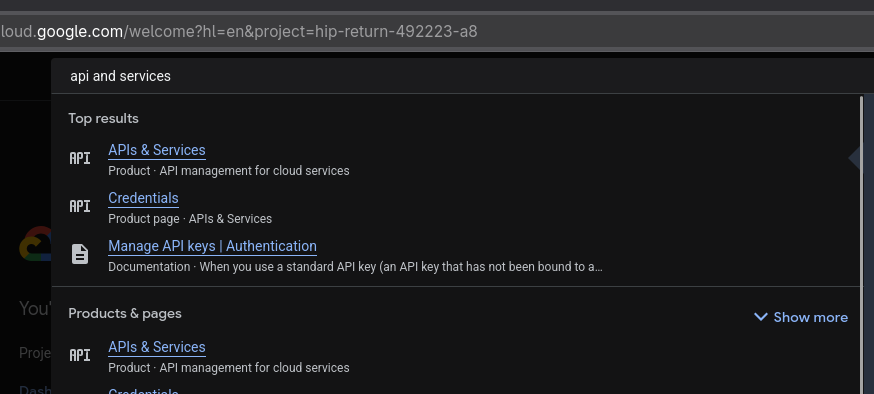

From the APIs dashboard, click `Enable APIs and services`.

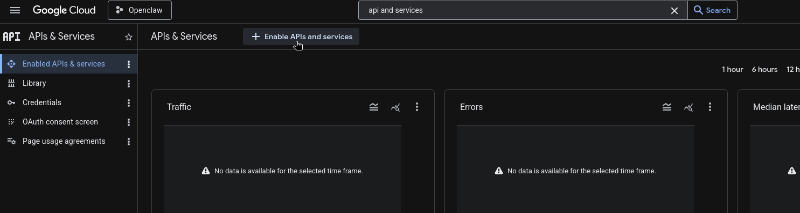

The Workspace API library is where you enable products like Gmail, Calendar, Drive, Sheets, and Admin SDK.

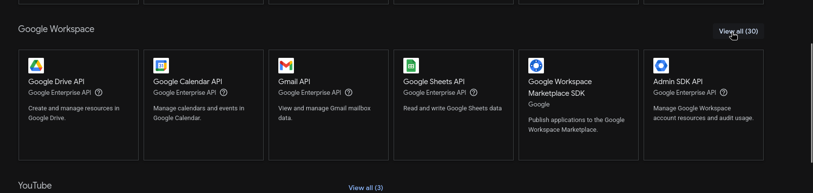

Each API has its own product page. Enable each one Clawbot needs.

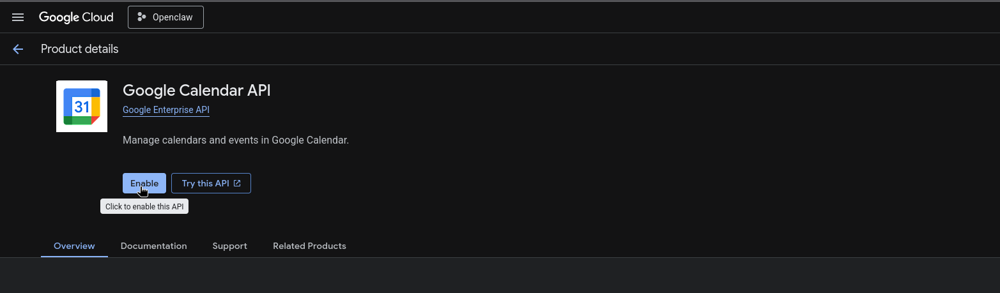

## 3. Configure the OAuth consent screen

Open the branding and audience pages:

- Branding: <https://console.cloud.google.com/auth/branding>
- Audience: <https://console.cloud.google.com/auth/audience>

Set up the consent screen for the project. If the app is left in `Testing`, Google requires you to add every account that will authenticate through this client as a test user.

From the main Google Cloud navigation, open the OAuth consent screen.

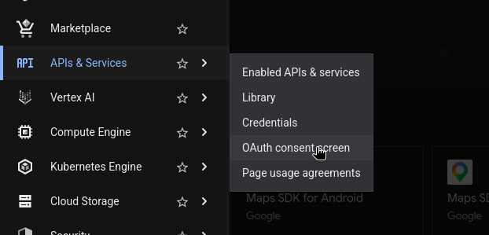

Fill in the branding information for the app.

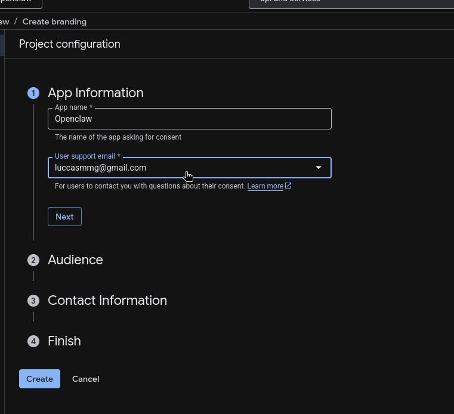

For most Clawbot setups, choose `External` unless this is strictly limited to users inside your Workspace org and you know you want an internal-only app.

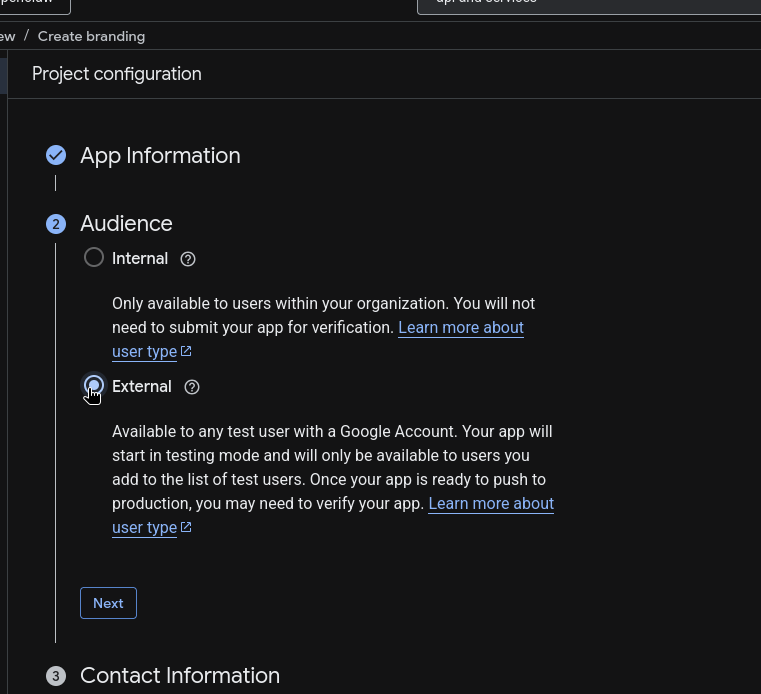

Google may also show the newer Google Auth Platform navigation. From there, go to the audience page.


Then add your test users.

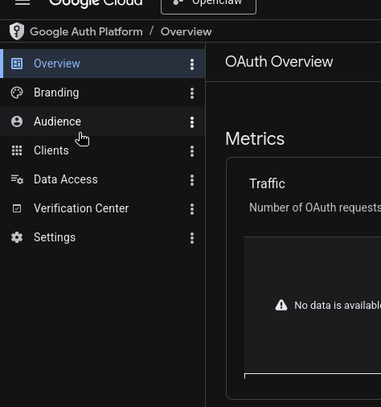

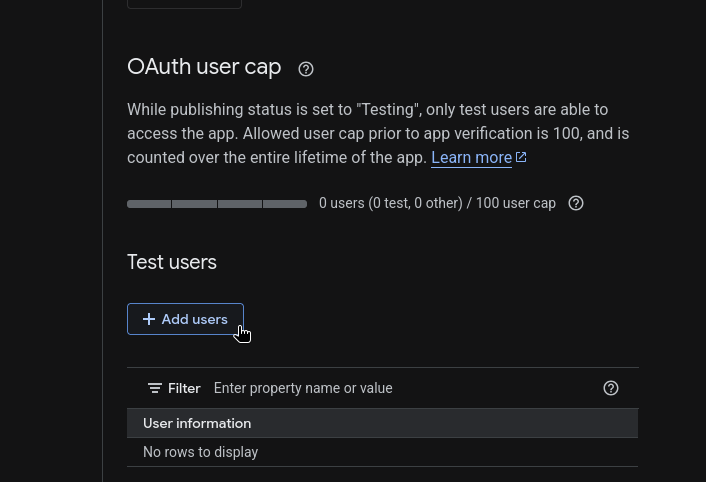

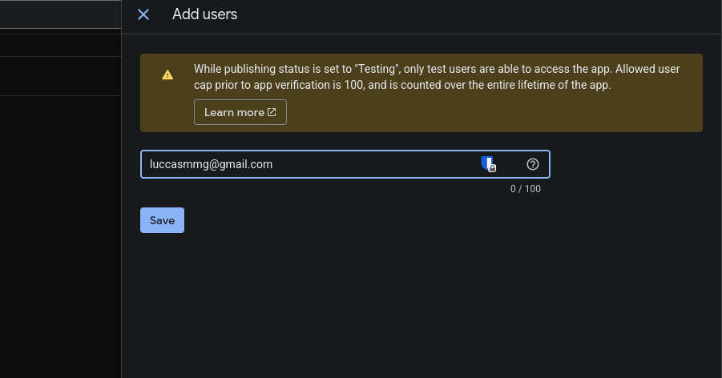

If you skip this, OAuth will usually fail with an access or app-verification error for anyone not explicitly allowlisted.

## 4. Create the OAuth client JSON

Go to <https://console.cloud.google.com/auth/clients> and create a client:

1. Click `Create Client`
2. Choose `Desktop app`
3. Download the JSON file

Open the credentials page first.

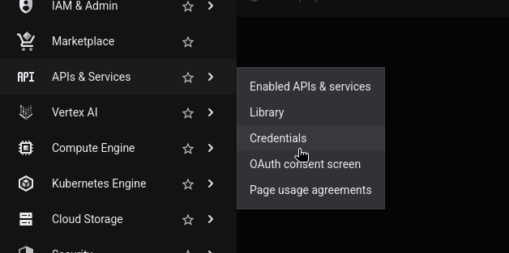

Then create an OAuth client and choose `Desktop app`.

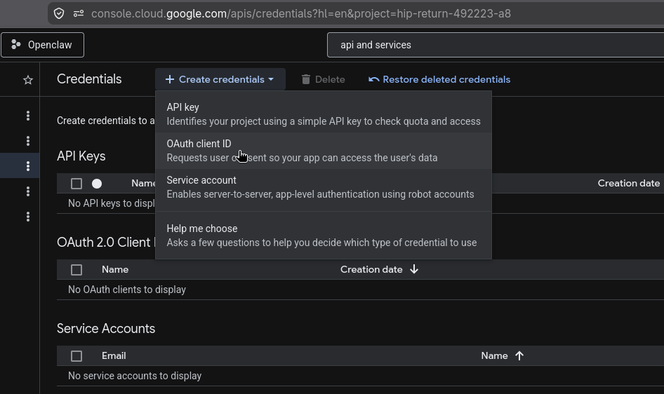

After the client is created, download the JSON immediately and store it safely.

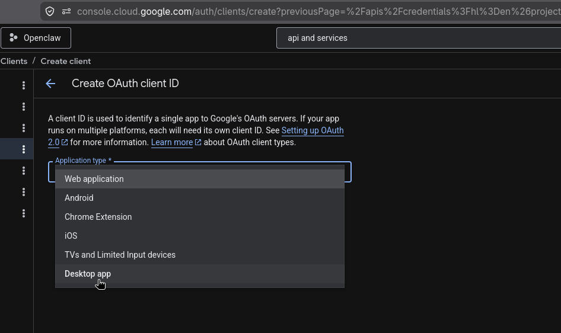

Google usually names it something like `client_secret_....apps.googleusercontent.com.json`.

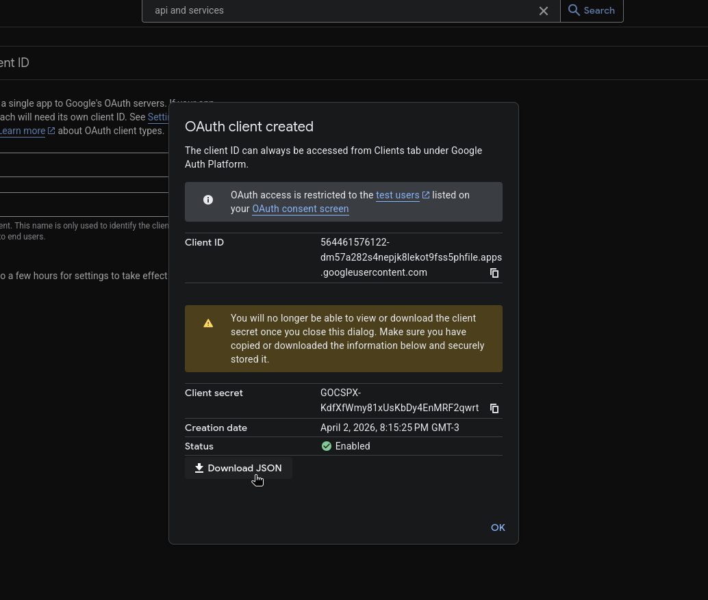

Do not commit this file into the repo.

## 5. Put the secret JSON on the Clawbot host

Pick a dedicated folder outside the git checkout. A good default is:

```bash
mkdir -p /opt/clawbot/secrets/google
chmod 700 /opt/clawbot/secrets/google
```

Save the OAuth client JSON there, for example:

```text
/opt/clawbot/secrets/google/workspace-oauth.json
```

Two practical ways to get the file onto the machine:

### Option A: send it through Telegram

Upload the JSON file to Clawbot in Telegram and ask it to save the attachment to:

```text
/opt/clawbot/secrets/google/workspace-oauth.json
```

Example prompt:

```text
Save this file to /opt/clawbot/secrets/google/workspace-oauth.json and do not move it into the repo.
```

### Option B: copy it with `scp`

From your local machine:

```bash
scp ~/Downloads/client_secret_123.json your-user@your-server:/opt/clawbot/secrets/google/workspace-oauth.json
```

Then fix permissions on the server if needed:

```bash
chmod 600 /opt/clawbot/secrets/google/workspace-oauth.json
```

## 6. Install `gogcli`

Follow the method that fits the host:

### Homebrew

```bash
brew install gogcli
```

### Arch

```bash
yay -S gogcli
```

### Build from source

```bash
git clone https://github.com/steipete/gogcli.git
cd gogcli
make
./bin/gog --help
```

After installation, verify:

```bash
gog --version
gog --help
```

## 7. Register the OAuth client with `gog`

Point `gog` at the JSON file you saved on the server:

```bash
gog auth credentials /opt/clawbot/secrets/google/workspace-oauth.json
```

If you want separate Google projects for different environments, use named clients:

```bash
gog --client work auth credentials /opt/clawbot/secrets/google/workspace-oauth.json
gog auth credentials list
```

For most setups, the default client is enough.

## 8. Authorize the Google account Clawbot should use

For a server or remote shell, the easiest flow is usually the manual one:

```bash
gog auth add you@company.com --services gmail,calendar,drive,docs,sheets,people,tasks --manual
```

What happens:

1. `gog` prints an authorization URL
2. Open that URL in a browser on your local machine
3. Sign in as the Google Workspace user
4. Approve the requested scopes
5. Copy the final redirect URL from the browser address bar
6. Paste that URL back into the terminal prompt on the server

If you only need read access at first, reduce the requested permissions:

```bash
gog auth add you@company.com --services gmail,calendar,drive --readonly --manual
```

If you later add new services and Google does not return a fresh token, retry with forced consent:

```bash
gog auth add you@company.com --services gmail,calendar,drive,docs,sheets --force-consent --manual
```

## 9. Verify the integration

Set the default account:

```bash
export GOG_ACCOUNT=you@company.com
```

Then test a few basic commands:

```bash
gog auth status
gog gmail labels list
gog calendar calendars
gog drive ls --max 5
```

If these work, Clawbot can use Google Workspace from the shell.

## 10. How Clawbot should use it

Once `gog` is installed and authenticated on the host, Clawbot does not need direct API integration code for many workflows. It can call `gog` commands and work with the results.

Typical examples:

```bash
gog gmail search 'label:inbox newer_than:3d' --json
gog calendar events primary --today --json
gog drive search 'quarterly report' --json
gog docs export <docId> --format markdown --out ./report.md
```

For agent reliability, prefer `--json` output anywhere Clawbot will parse the result.

## Recommended scope strategy

Start narrow. Only request the services Clawbot really needs.

- Email assistant: `gmail`
- Scheduling assistant: `calendar`
- File assistant: `drive,docs,sheets`
- People lookup: `people`
- Task manager: `tasks`

This keeps the consent surface smaller and reduces the blast radius if the account is compromised.

## Advanced: Workspace service account setup

Use this only if you need domain-wide delegation, admin operations, or Workspace-only APIs that should run without a human signing in interactively.

High-level flow:

1. Create a Google Cloud service account
2. Enable domain-wide delegation on it
3. In Google Workspace Admin, allowlist the OAuth scopes for that service account client ID
4. Download the service account JSON key
5. Put it on the server, again outside the repo
6. Configure `gog`:

```bash
gog auth service-account set you@yourdomain.com --key /opt/clawbot/secrets/google/service-account.json
gog --account you@yourdomain.com auth status
```

This is the right model for org-wide automation, but it is more sensitive operationally because it can impersonate Workspace users if delegation is granted.

## Security notes

- Never commit OAuth client JSON or service account JSON into git
- Keep secret files outside the repo, ideally under `/opt/clawbot/secrets/`
- Lock permissions down with `chmod 600`
- Prefer least-privilege scopes
- Use separate Google Cloud projects for dev and prod
- Remove unused tokens with `gog auth remove <email>`

## Common failure modes

**OAuth says the app is not allowed**

The user is probably not in the test-user list on the consent screen audience page.

**A command returns `403 insufficient scopes`**

The token was authorized without the needed service scope. Re-run `gog auth add ... --force-consent` with the right `--services` values.

**The server has no browser**

Use `--manual` during `gog auth add`.

**Clawbot can run commands manually but not inside automation**

Set `GOG_ACCOUNT` in the runtime environment so the account selection is explicit.

## Minimal production checklist

Before you call this done, make sure all of these are true:

1. The Google Cloud project is dedicated to Clawbot
2. Only required APIs are enabled
3. Test users are added if the app is still in testing
4. The OAuth JSON is stored at `/opt/clawbot/secrets/google/workspace-oauth.json`
5. `gog auth credentials` has been run on the host
6. `gog auth add ... --manual` completed successfully
7. `gog gmail labels list` or another real command works from the Clawbot host

At that point, Clawbot can use Google Workspace through `gogcli` with no extra middleware beyond shell access.
