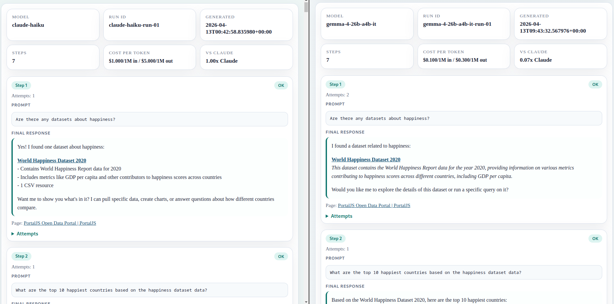

# How to Compare LLM Quality for Your OpenClaw Use Case

We did not start this exercise because we wanted to write about benchmarks.

We started because we had a practical cost problem.

The workflow we cared about was an AI data analysis workflow built on top of OpenClaw. In practice, that meant an agent that had to identify relevant data, answer questions grounded in that data, produce structured outputs like tables or charts, and generate a final report that a user could actually use.

For that workflow, we originally used Claude Sonnet. Later, we switched to Claude Haiku and it worked well enough for the job. That was already a meaningful cost reduction. But "good enough and cheaper" was still not the end of the question. We wanted to know whether we could cut costs even further without breaking the workflow.

That is what pushed us into a real model comparison.

At that point, generic benchmark rankings were not very helpful. They can tell you something about broad model ability, but they do not tell you whether a model can survive your actual OpenClaw workflow: the prompts, the context, the tools, the structured outputs, the final artifacts, and the failure modes that appear in the real product path.

So instead of asking which model is best in general, we asked a much narrower question:

> Which model is good enough for this OpenClaw workflow at a lower cost?

That led us to Cloudflare Workers AI, which exposes a set of open-source models through an OpenAI-compatible API. That made it practical to wire several lower-cost models into the same OpenClaw setup and compare them against the Claude baseline without changing the surrounding workflow too much.

For our workflow, the conclusion was useful and concrete: Gemma was able to handle the workflow at roughly the same level as Claude Haiku, which made it the strongest lower-cost alternative from the set we tested.

This playbook explains the process we followed so you can repeat it for a different OpenClaw workflow.

## What this process is for

This is a workflow comparison process, not a prompt benchmark.

Use it when:

- you already have one OpenClaw workflow that matters to users
- you want to compare models or providers on that workflow
- you are trying to lower cost without losing too much quality
- you want repeated runs instead of one-off impressions
- you want a report that your team can review later

Do not use this process if all you need is a quick prompt comparison with no real workflow behind it.

## The core idea

Keep the workflow fixed. Change only the model.

That means keeping these things stable across the comparison:

- the workflow being tested
- the OpenClaw agent path
- the tools available to the agent
- the product or user path around the agent
- the evaluation criteria

Only the provider and model should change.

If you change the workflow and the model at the same time, the comparison stops being meaningful.

## The steps

### 1. Figure out how to switch models in your OpenClaw deployment

Before choosing a shortlist, you need to know how model switching actually works in the deployment you are testing.

That usually means answering three practical questions:

1. Where is the active model configured?
2. How do you switch it safely?
3. How do you verify that the switch took effect?

In many OpenClaw setups, the right switching boundary is the agent configuration itself. The product or UI should keep using the same stable agent entry point, while the configured provider or model changes behind it.

The key point is that model switching is an OpenClaw concern, not a workflow-design concern. If you cannot switch models cleanly and verify the active one, everything else becomes noisy.

In our case, one useful discovery was that Cloudflare Workers AI could fit into this process cleanly because it offers an OpenAI-compatible API surface. That made it much easier to compare several candidate models through the same general integration pattern.

### 2. Decide which models and providers to test

Once model switching is clear, choose a shortlist.

A practical shortlist usually includes:

- one baseline model that already works
- several lower-cost alternatives
- optionally one or two strategically interesting models even if they are not the absolute cheapest

The providers might include:

- Anthropic
- OpenAI
- Cloudflare Workers AI
- any other provider that can be wired into the same OpenClaw path

The goal is not to build a giant leaderboard. The goal is to compare a small number of credible options against the workflow you actually care about.

### 3. Define the workflow to be tested

This is the most important part.

Pick one workflow that already matters to users and write it down as a fixed sequence of steps.

A useful workflow usually includes more than one kind of behavior. For example:

- retrieving or identifying relevant information
- grounded question answering
- structured output such as a table or list
- a visualization, action, or other non-trivial output
- a final artifact such as a report

The workflow should be rich enough to expose real failure modes, but short enough that you can run it several times per model.

Do not try to benchmark your entire product at once. Start with one workflow.

### 4. Define the evaluation criteria

Before running anything, decide what "good enough" means.

For OpenClaw workflows, the useful criteria are usually practical rather than academic:

- did the model complete the workflow
- did it stay grounded in the workflow context and available tools
- did it produce usable outputs
- did it avoid obvious behavioral failures
- was it stable enough across repeated runs
- was the quality acceptable relative to the baseline

That last point matters. The objective is often not "find the best model." The objective is "find the cheapest model that still survives the workflow."

### 5. Run one smoke test per model

Start with one full run for each candidate model.

This is just a fast filter. It helps reject obvious failures early:

- models that cannot complete the workflow
- models that return the wrong kind of output
- models that expose internal tool-style text
- models that are too unstable to evaluate seriously

If a model clearly fails the smoke test, do not spend more time on it yet.

### 6. Run multiple evaluations per viable model

For the models that survive the smoke-test phase, run the same workflow multiple times.

This matters because one run is not enough. Agent workflows vary, and some models are much noisier than others.

For each run, capture:

- provider and model
- run identifier
- final output for each workflow step
- retries or failures
- notes about what broke

The exact number of runs depends on your tolerance for variance, but the rule is simple: do not trust a single run.

### 7. Create a report

Do not leave the results in scattered logs.

Create a report that makes it easy to compare runs side by side. In our case, an HTML report worked well because it could show every run, every workflow step, and the outputs in a format that was easy to review later.

That artifact matters. Once multiple people are involved, the report becomes more useful than anyone's memory of the test runs.



### 8. Compare viability first, cost second

This is the part that people often get backwards.

A model that is much cheaper but cannot survive the workflow is not a cheaper option. It is just unusable.

The correct order is:

1. confirm that the model can complete the workflow
2. compare stability and obvious quality differences
3. only then compare price and cost per run

That is how you keep the process tied to product reality instead of turning it into a pricing spreadsheet.

## What we learned along the way

A few lessons were useful beyond the specific workflow.

First, repeated runs matter. Some models looked acceptable once and weak later. Without repeated runs, we would have overestimated them.

Second, infrastructure noise can distort the results. Timeouts and unstable request paths can make a model look worse than it really is. That does not invalidate the process, but it does mean you should separate model failures from infrastructure failures whenever possible.

Third, the most obvious failures are often behavioral rather than intellectual. Some models do not just give weaker answers. They fail in ways that make them unsuitable for the workflow: wrong output types, broken structure, or incorrect assistant behavior.

Fourth, the final answer is usually not a universal ranking. It is a workflow-specific answer. In our case, Gemma looked like the best lower-cost alternative for the workflow we cared about. That does not mean it will be the best answer for every OpenClaw deployment.

## Results

The practical result of this process was straightforward.

We started from Claude Sonnet, moved to Claude Haiku as a cheaper option, and then tested whether we could go lower still by trying Cloudflare-served open-source models through an OpenAI-compatible path.

For our workflow, Gemma was the strongest result from that comparison. It was able to do the work at roughly the same level as Claude Haiku, which made it the most convincing lower-cost alternative from the set we tried.

That does not mean "Gemma is the best OpenClaw model." It means that for this workflow, with this evaluation method, Gemma was the best tradeoff we found.

That is the right way to read these results.

## Final recommendation

If you want to compare models for an OpenClaw use case, do not start from a leaderboard.

Start from one real workflow, define what "good enough" means, switch only the model, run it multiple times, and build a report that other people can inspect.

That process will usually tell you more than any benchmark chart.

## Appendix: Copy/Paste Skill

Use this prompt with another model when you want help setting up the same evaluation process for a different OpenClaw workflow.

```text
You are helping set up a model-comparison process for a real OpenClaw workflow.

Your goal is to guide the user through setting up and running a practical workflow benchmark, not a prompt benchmark.

You must guide the user through these steps in order:

1. Ask how to connect to the OpenClaw instance.
Figure out how the active model can be switched. For example: is access via SSH, a local shell, Docker, a control plane, or some other interface?

2. Ask how model switching works in that deployment.
Determine where the active provider/model is configured, how to switch it safely, and how to verify the active model before testing.

3. Ask what workflow should be tested.
The workflow must be a real OpenClaw use case and should be written as a fixed sequence of steps.

4. Ask which providers and models should be tested.
Help the user build a shortlist that includes one baseline model and several credible alternatives.

5. Help define the evaluation criteria.
Figure out what counts as a successful run, what counts as a failure, how many runs should be done per model, and whether retries are allowed.

6. Run one smoke test per model.
Use the exact same workflow and reject obvious failures early.

7. For viable models, run multiple evaluations per model.
Capture the model name, run identifier, outputs for each workflow step, retries, failures, and notes about what broke.

8. Build a comparison report.
The report should make it easy to compare multiple runs across multiple models side by side. It should include one section per model, one entry per run, the workflow steps in order, the captured outputs, retries or failures, and short notes about what broke.

Important rules:

- Keep the workflow fixed across models.
- Keep the OpenClaw agent path fixed across models.
- Change only the model/provider.
- First discover how the target workflow is actually accessed and observed.
- Adapt the evaluation process to the concrete OpenClaw workflow being tested.
- Separate model failures from infrastructure failures where possible.
- Compare viability first, then cost.

Your output should be practical and procedural. Prefer exact setup questions, model-switching steps, run discipline, and report structure over generic benchmarking advice.
```
