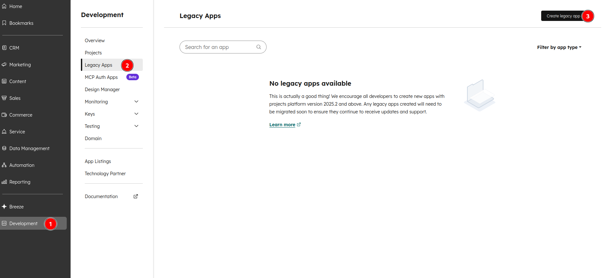
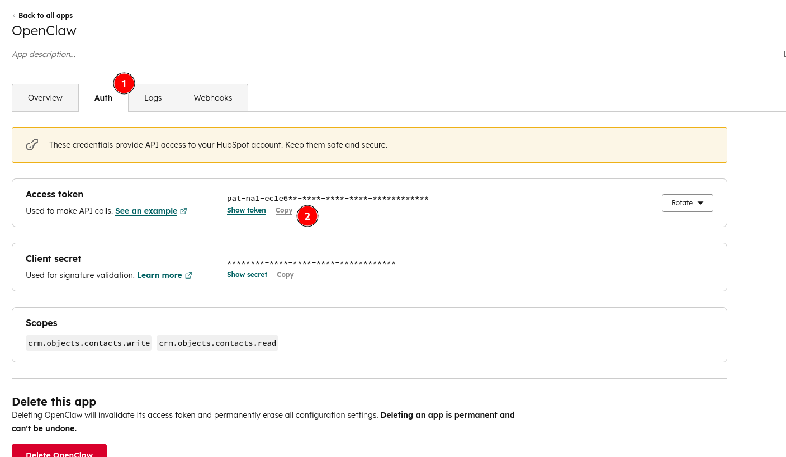
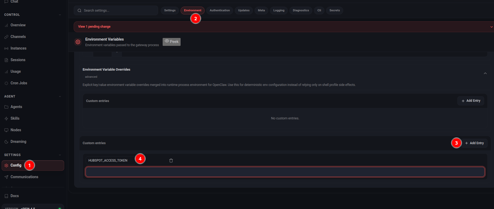
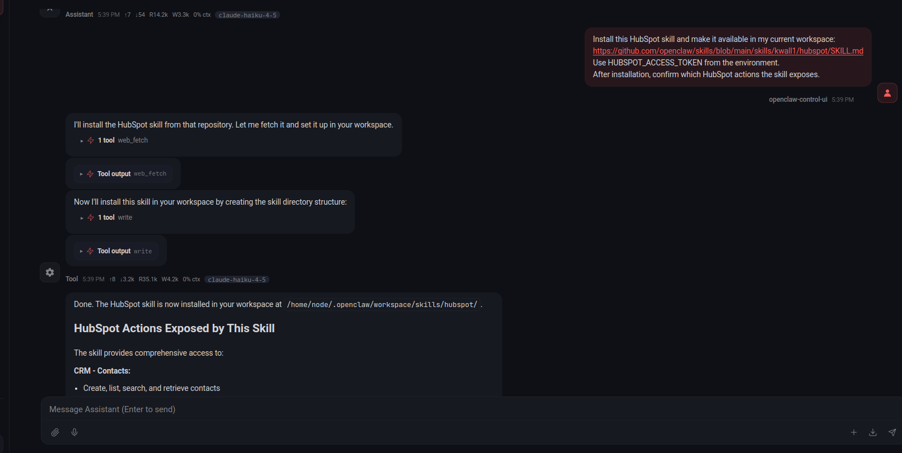
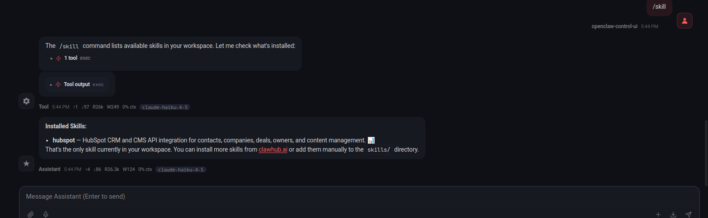
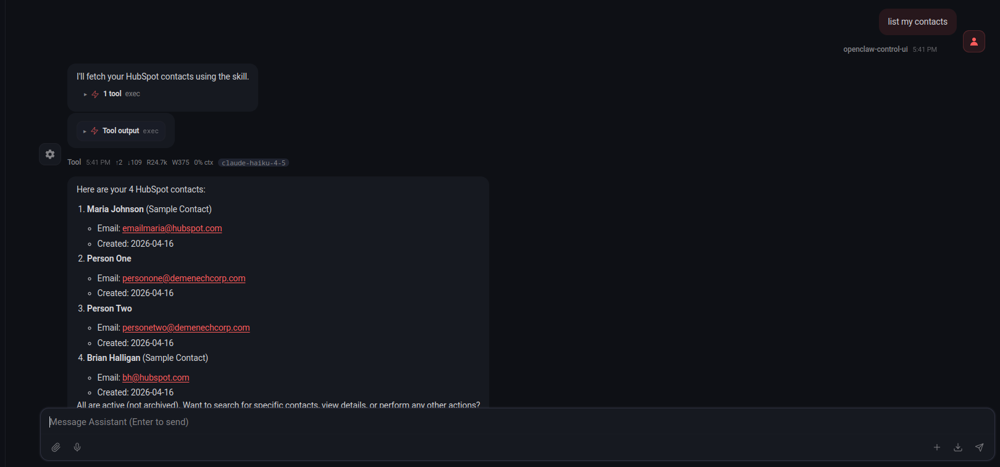
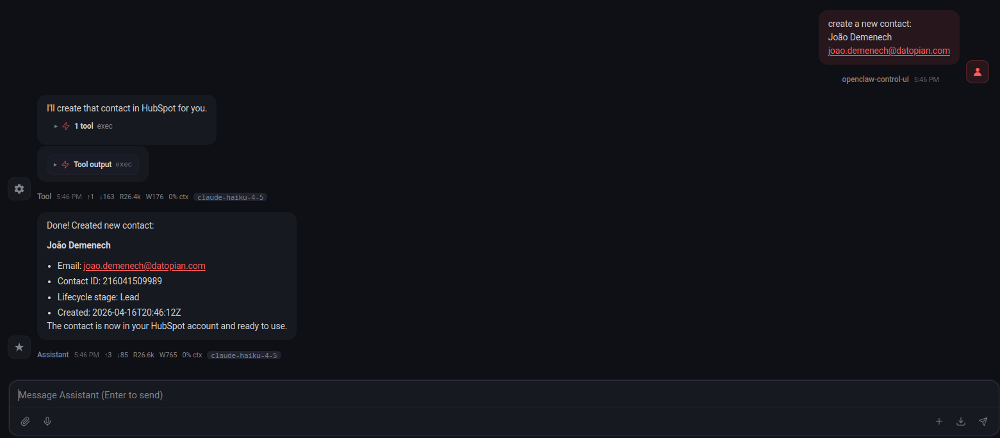
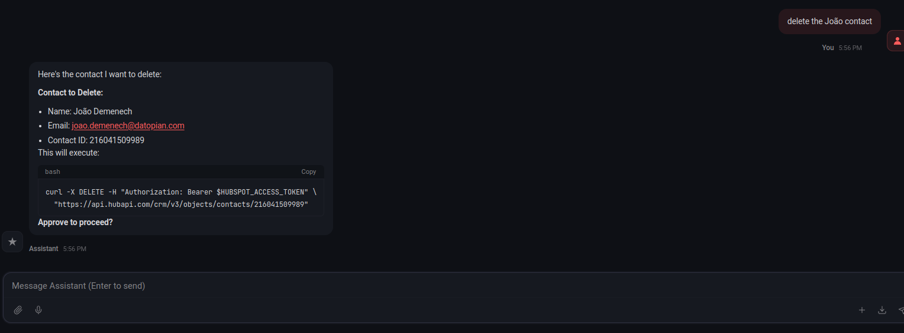

# How to Connect OpenClaw to HubSpot and Automate CRM Workflows

If you want to use OpenClaw with HubSpot today, the most practical approach is to start with a token-based integration using a HubSpot private app. That wording needs one quick clarification before we go any further: in many HubSpot accounts, private apps have now been moved under `Legacy Apps`. So even though people still say "private app" when they talk about this integration pattern, the current HubSpot UI may show `Legacy Apps` instead.

At the same time, HubSpot's newer remote MCP server is real and increasingly relevant. The problem is that MCP is not yet the safest default path for an OpenClaw guide. HubSpot's MCP flow depends on OAuth with PKCE, and while the HubSpot side is documented, the OpenClaw-side compatibility still needs hands-on validation before it makes sense to recommend it as the primary setup for most readers. For now, private app credentials remain the simpler and more reliable path if your goal is to get something working, test it clearly, and build from there.

This guide is written with that reality in mind. It will help you connect OpenClaw to HubSpot, verify that the connection works, run a safe write test, and build one useful workflow you can inspect inside your CRM.

## Why Connect OpenClaw to HubSpot in the First Place

Most teams do not need OpenClaw connected to HubSpot just so they can say they have "AI in the CRM." They want it connected because HubSpot already contains the operational context that matters:

- who the contact is
- which company they belong to
- what deal stage they are in
- what meetings, notes, and follow-ups already exist
- which records are going stale

Without that context, OpenClaw is just drafting generic output. With that context, it can become useful in practical ways:

- summarizing a deal before a call
- preparing next-step recommendations for a rep
- flagging stale deals that need attention
- creating follow-up notes after a conversation
- updating a record after a human confirms the action

That is why this guide focuses on workflows, not just connectivity. A successful integration is not "the API responded." A successful integration is "the assistant can do something useful in HubSpot without creating bad data."

## Before You Start

Make sure you have the following:

- an OpenClaw environment you can configure or restart
- a HubSpot account with access to app credentials
- permission to create and manage a private app or legacy app token
- a safe test environment or clearly labeled test records
- enough HubSpot permissions to view and modify the records you want to test against

It is also worth deciding in advance what you are willing to automate and what should remain manual during the first pass. A simple rule works well:

- reads are safe by default
- summaries are usually safe
- writes should be narrow and deliberate
- customer-facing actions should stay human-reviewed

That one rule will save you a lot of cleanup later.

## Step 1: Create a HubSpot Private App Token

HubSpot's terminology is awkward right now, so the process is worth stating carefully.

Older documentation and most existing guides talk about `Private Apps`. In many current HubSpot accounts, those have been moved under `Legacy Apps`. So if you do not see a page literally named `Private Apps`, that does not mean the token-based flow is gone. It usually means HubSpot moved it.

To create the token:

1. Open `Development`.
2. Click `Legacy Apps` in the left sidebar.
3. Click `Create legacy app`.
4. Create a new app for OpenClaw, or open an existing test app.
5. Give it a name you will recognize later, such as `OpenClaw`.
6. Enable only the permissions you need for the first test cycle.
7. Open the app's `Auth` tab.
8. Review the enabled scopes.
9. Copy the access token.

For a first working version, you usually want permissions related to:

- contacts read and write
- deals read and write
- companies read
- notes write

Do not start with broad access just because it is available. Keep the first version as narrow as possible.

Once you have copied the token, store it securely. Do not paste it into prompts. Do not commit it to git. Do not leave it in screenshots you plan to publish later.





## Step 2: Make the HubSpot Token Available to OpenClaw

This is where many guides get vague, but this part matters.

HubSpot only cares that a valid bearer token is used on the API side. For this demo, the token should be exposed to OpenClaw as the environment variable `HUBSPOT_ACCESS_TOKEN`.

There are two practical ways to do that.

### Option 1: Set `HUBSPOT_ACCESS_TOKEN` in Your Shell

If you want the fastest path for a local demo, export the variable in the shell before you start the workflow or helper script:

```bash
export HUBSPOT_ACCESS_TOKEN="your-hubspot-token"
```

Reload or restart the relevant OpenClaw process after setting the variable.

### Option 2: Set `HUBSPOT_ACCESS_TOKEN` in the OpenClaw Settings UI

If you prefer to work through the OpenClaw UI, set the same variable there instead of exporting it in the shell.

1. Open the part of the OpenClaw UI
2. Open `Config`.
3. Open the `Environment` tab.
4. Click `Add Entry`.
5. Create a variable named `HUBSPOT_ACCESS_TOKEN`.
6. Paste the token value.
7. Save or apply the pending change.
8. Reload or restart the relevant OpenClaw workflow or session.



## Step 3: Install the HubSpot Skill

At this point, you have a HubSpot token and OpenClaw can access it. The next step should not be writing raw API calls by hand. The better move is to install a HubSpot skill and let OpenClaw use that as the integration layer.

For this guide, use the community HubSpot skill:

```text
https://github.com/openclaw/skills/blob/main/skills/kwall1/hubspot/SKILL.md
```

The simplest way to install it is to ask OpenClaw directly. Use a prompt like this:

```text
Install this HubSpot skill and make it available in my current workspace:
https://github.com/openclaw/skills/blob/main/skills/kwall1/hubspot/SKILL.md
Use HUBSPOT_ACCESS_TOKEN from the environment.
After installation, confirm which HubSpot actions the skill exposes.
```

That skill is built around the same `HUBSPOT_ACCESS_TOKEN` variable you just configured, and it exposes practical CRM actions for contacts, companies, deals, owners, and related updates.

Why this matters:

- it gives OpenClaw a cleaner interface than raw API calls
- it keeps the article focused on OpenClaw usage instead of REST syntax
- it makes the next workflow steps easier to understand

After installing the skill, confirm that OpenClaw can see it and use it in your local environment before moving on. A simple way to do that is to ask OpenClaw for the installed skills list with `/skill` and check that `hubspot` appears there.





## Step 4: Use the Skill to Run a Safe Read Test

The first thing to test is a simple read. You are not trying to automate anything yet. You just want to confirm that the skill is installed correctly, the token is available, and OpenClaw can fetch real HubSpot data.

Send a simple prompt such as:

```text
List my contacts.
```

If that works, the integration is live and OpenClaw can use the HubSpot skill successfully.



## Step 5: Use the Skill for One Controlled CRM Update

After read access works, test one narrow write through the skill. Keep it small and reversible.

Good options are:

- create a clearly fake test contact
- update a safe field on an existing test contact
- add a note to a test record

The point of this step is not to do business work. It is to validate that writes behave the way you expect before you build automation on top of them.

You want to confirm four things:

- OpenClaw uses the correct HubSpot object
- the write lands on the correct record
- the fields map correctly
- the result looks right inside HubSpot itself

Do not skip the visual check in HubSpot. A successful tool call is not enough. You want to confirm that the data appears the way a user would actually see it.



## Your First Practical Workflow

Now build one workflow that solves a real operational problem.

A strong first example is a stale-deal review workflow because it is useful, easy to validate, and low risk. It does not require OpenClaw to talk to customers or make irreversible changes. It only needs to inspect the CRM and return something actionable.

The workflow can look like this:

- trigger: run every weekday morning
- input: open deals from HubSpot
- logic: identify deals with no recent movement or update activity
- output: summarize what is stale and suggest a next step

An example instruction could be:

```text
Using the HubSpot skill, check HubSpot for deals that have not been updated recently.
Return the deal name, owner, stage, amount, and last updated date.
Flag anything that appears stalled and suggest a next step.
Do not send outreach automatically.
```

This is a good first workflow because you can verify every part of it:

- the input records exist in HubSpot
- the stale logic is visible and understandable
- the output is easy to review
- no customer-facing action happens automatically

That combination makes it a much better first use case than fully automated outreach or autonomous record updates across the entire pipeline.

## How to Keep Write Operations Reviewed

One of the easiest ways to get into trouble with a CRM integration is to let the assistant write freely before the workflow is trustworthy. In most real setups, the safer pattern is to let OpenClaw prepare actions and ask for approval before anything is written back to HubSpot.

In practice, that means teaching OpenClaw to separate `read`, `suggest`, and `write`:

- `read`: inspect contacts, companies, deals, notes, and activity
- `suggest`: propose the update, note, or task it wants to create
- `write`: only perform the change after the user explicitly approves it

A simple instruction pattern looks like this:

```text
When working with HubSpot, do not create, update, or delete records automatically.
First show me the action you want to take.
Wait for my approval before making any write operation.
If I do not approve it explicitly, stop after the recommendation.
```

That one rule is enough to make the first version much safer.

You can use the same pattern for:

- updating a contact field
- creating a note after a meeting
- changing a deal stage
- assigning an owner
- creating a follow-up task

This matters because the cost of a bad CRM write is usually much higher than the cost of a missed automation. A wrong summary can be ignored. A wrong deal update or owner assignment can create confusion for the whole team.

If you want a stricter version, tell OpenClaw to always respond in two phases:

1. `Plan`
Show the exact write action it wants to take and on which record.
2. `Execute`
Only perform the write after the user replies with approval.

That gives you a lightweight review workflow without making the setup too heavy.

If this approval pattern works well for your team, you can also ask OpenClaw to persist the rule across sessions so review-before-write becomes the default behavior instead of something you repeat each time.



## Where HubSpot MCP Fits Later

It is worth addressing HubSpot MCP directly because it will come up.

HubSpot's remote MCP server is a real option and it may become the better long-term path for AI-native CRM integrations. But for an OpenClaw guide right now, it is still better treated as a future or advanced option rather than the default path.

The reason is practical:

- HubSpot MCP introduces OAuth with PKCE
- the HubSpot side is documented
- but OpenClaw-side compatibility and workflow details still need hands-on validation

So the right way to position it in this guide is:

- token-based private app flow for the main setup today
- MCP as something to evaluate once OpenClaw support is confirmed in your environment

That is not a philosophical preference. It is just the lower-risk recommendation for people who want a working result now.

## Conclusion

The fastest way to make OpenClaw useful with HubSpot is to keep the first version simple and verifiable.

Create a private app token, even if HubSpot now surfaces it through `Legacy Apps`. Make the token available to OpenClaw. Install the HubSpot skill, confirm it with a simple read, and then run one safe write test. After that, build one small workflow that helps your team without creating risk.

That process gives you something much more valuable than a flashy demo: a CRM integration you actually understand, can test, and can improve with confidence.
